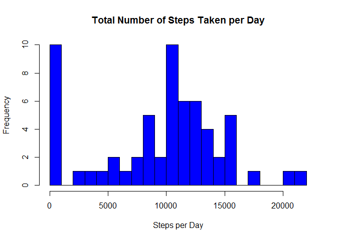
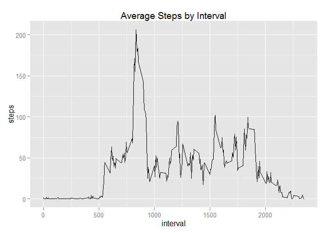
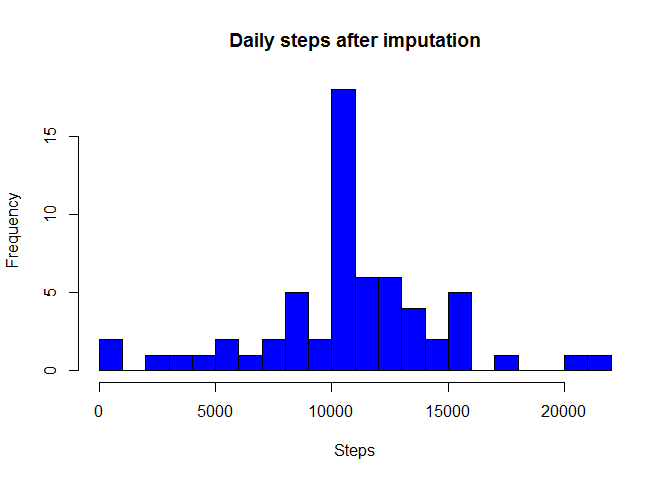
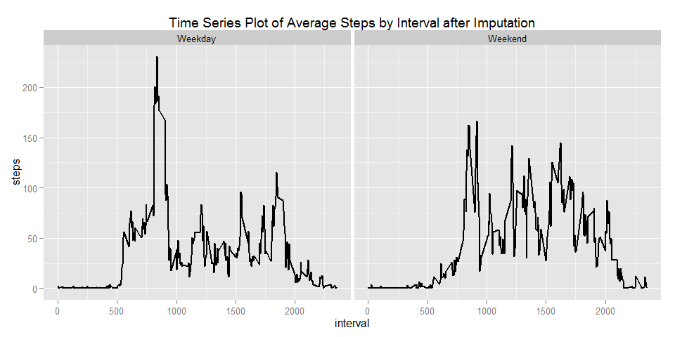

# Activity Monitoring Data - repdata-011- Assignment 1
Jacek  
15/07/2015  


**This document contains the work for peer assignment 1 for the Reproducible Research course.**


## Loading and preprocessing the data

```r
#Load the data (i.e. read.csv())
acrtivityData <- read.csv("data/activity.csv")

#Process/transform the data (if necessary) into a format suitable for your analysis
acrtivityData$date <- as.Date(acrtivityData$date)
totalSteps <- aggregate(x = acrtivityData$steps , by = list(acrtivityData$date), FUN = sum ,na.rm=TRUE)
```


## What is mean total number of steps taken per day?

```r
#histogram of the total number of steps taken each day
library(ggplot2)
```

```
## Warning: package 'ggplot2' was built under R version 3.2.1
```

```r
names(totalSteps) <- c("date","steps")

hist(totalSteps$steps,
     breaks=20,
     col = "blue",
     main = "Total Number of Steps Taken per Day",
     xlab = "Steps per Day")
```

 

```r
#mean total number of steps taken per day
mean(totalSteps$steps , na.rm = TRUE)
```

```
## [1] 9354.23
```

```r
#median total number of steps taken per day
median(totalSteps$steps , na.rm = TRUE)
```

```
## [1] 10395
```


## What is the average daily activity pattern?

```r
#Time series plot of 5-minute interval and the average number of steps taken, averaged across all days
averageSteps  <- aggregate(x = acrtivityData$steps , by = list(acrtivityData$interval), FUN = mean ,na.rm=TRUE)
names(averageSteps) <- c("interval","steps")

ggplot(averageSteps, aes(interval,steps)) +
                 ggtitle("Average Steps by Interval") +
                 geom_line()
```

 

```r
#The 5-min time interval contains the maximum number of steps?
averageSteps[which.max(averageSteps$steps),c("interval")]
```

```
## [1] 835
```


## Imputing missing values

```r
#total number of missing values in the dataset
nrow(acrtivityData[is.na(acrtivityData$steps),])
```

```
## [1] 2304
```

```r
#imputing missing step values with mean step at time interval
acrtivityData.imputed <- merge(x = acrtivityData, y = averageSteps, by = "interval", all.x = TRUE)
acrtivityData.imputed[is.na(acrtivityData.imputed$steps.x),c("steps.x")] <- acrtivityData.imputed[is.na(acrtivityData.imputed$steps.x),c("steps.y")]

#cleaning data
acrtivityData.imputed$date <- as.Date(acrtivityData.imputed$date)
acrtivityData.imputed$date.x <- NULL
acrtivityData.imputed$Group.1 <- NULL
acrtivityData.imputed$steps <- acrtivityData.imputed$steps.x
acrtivityData.imputed$steps.x <- NULL
acrtivityData.imputed$steps.y <- NULL

#histogram with new dataframe
stepsByDate <- aggregate(x = acrtivityData.imputed$steps , by = list(acrtivityData.imputed$date), FUN = sum ,na.rm=TRUE)
names(stepsByDate) <- c("date","steps")

hist(stepsByDate$steps,
     breaks=20,
     col = "blue",
     main = "Daily steps after imputation",
     xlab = "Steps")
```

 

```r
#mean total number of steps taken per day
mean(stepsByDate$steps , na.rm = TRUE)
```

```
## [1] 10766.19
```

```r
#median total number of steps taken per day
median(stepsByDate$steps , na.rm = TRUE)
```

```
## [1] 10766.19
```


## Are there differences in activity patterns between weekdays and weekends?

```r
#Factor variable with two levels indicating a weekday or weekend.
acrtivityData.imputed$weekday <- as.factor(ifelse(weekdays(acrtivityData.imputed$date) %in% c("Saturday","Sunday"), "Weekend", "Weekday")) 

averageStepsWeekday  <- aggregate(x = acrtivityData.imputed$steps ,
                                  by = list(acrtivityData.imputed$interval, acrtivityData.imputed$weekday), 
                                  FUN = mean, 
                                  na.rm=TRUE)

names(averageStepsWeekday) <- c("interval","weekday","steps")

#panel time series plot of the 5-minute interval and the average number of steps taken 
#averaged across all weekday days or weekend days.
ggplot(averageStepsWeekday, aes(interval,steps)) +
                 ggtitle("Time Series Plot of Average Steps by Interval after Imputation") +
                 facet_grid(. ~ weekday) +
                 geom_line(size = 1)
```

 
